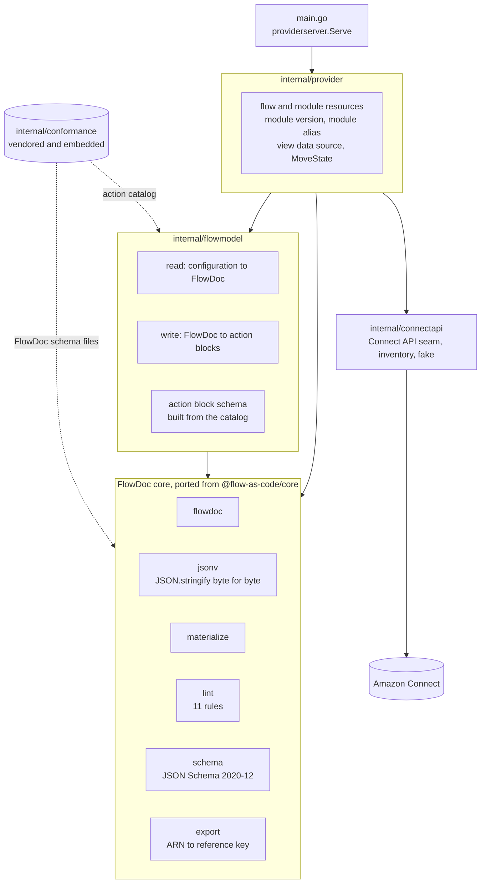
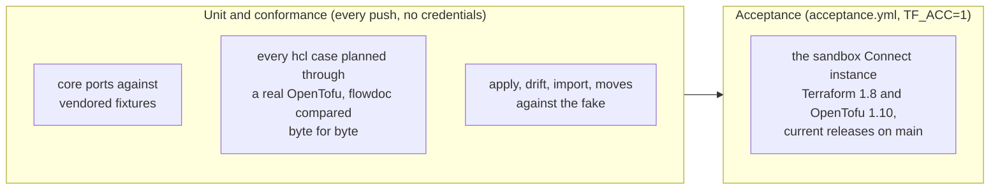

# Architecture

How the provider is put together, for someone about to change it. The
[README](README.md) says what it does; `conformance/hcl/README.md` in
flow-as-code (vendored under `internal/conformance/data/hcl/`) is the contract
it implements.

## Packages

- `internal/provider`: the provider block (hashicorp/aws's configuration
  vocabulary on aws-sdk-go-base) and every resource. `flowbody.go` is what
  the flow and module resources share: reading a configuration, planning it
  (`flowdoc`, lint, `content`, `content_hash`) and syncing tags.
  `flow_resource.go` serves both `flowascode_contact_flow` and
  `flowascode_contact_flow_module`, including drift reconstruction and import.
- `internal/flowmodel`: the only place that knows the `action` block shape.
  `read.go` turns a configuration into a FlowDoc and reports contract errors
  by code; `write.go` turns a FlowDoc back into blocks, choosing a typed
  sub-block only when it holds the action's Parameters exactly and `generic`
  otherwise, so nothing is ever dropped.
- FlowDoc core (`flowdoc`, `jsonv`, `materialize`, `lint`, `schema`,
  `export`): one-to-one ports of `@flow-as-code/core`. Documents are ordered
  JSON rather than structs, because the bytes are the contract.
- `internal/connectapi`: exactly the Connect operations the provider calls,
  each with its API reference URL, the inventory lists import uses, and an
  in-memory fake that behaves like Connect where the tests depend on it
  (published and saved content, module versions an alias holds).
- `internal/conformance`: flow-as-code's `conformance/` at the commit in
  `COMMIT`, embedded. `scripts/sync-conformance.sh` is the only writer, and
  `MANIFEST.json` lets a test detect a hand edit.

## Tests in three layers

- Core ports run the same fixtures as the TypeScript packages and, where a
  fixture has no expected output, compare against oracles recorded from
  `packages/core/dist`.
- `conformance_test.go` and `cases_test.go` run every `hcl/roundtrip`,
  `hcl/parse`, `hcl/refuse` and `hcl/emit` case through a real CLI with the
  provider served in process, reading the plan's JSON directly.
- `acceptance_test.go` creates real flows, modules, queues and hours in a
  sandbox instance, names everything `tfacc-...`, and sweeps before and after.

Every guarantee here was shown to fail first: break the code the test
guards, watch it go red, restore it. `CONTRIBUTING.md` holds new work to the
same rule.
