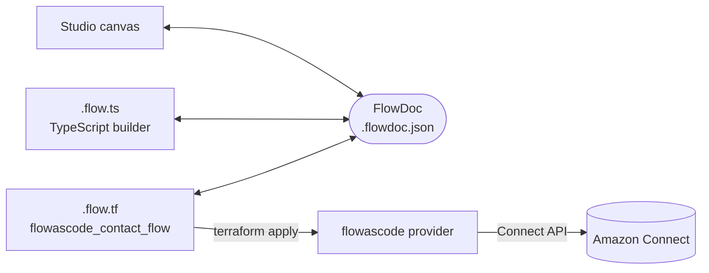
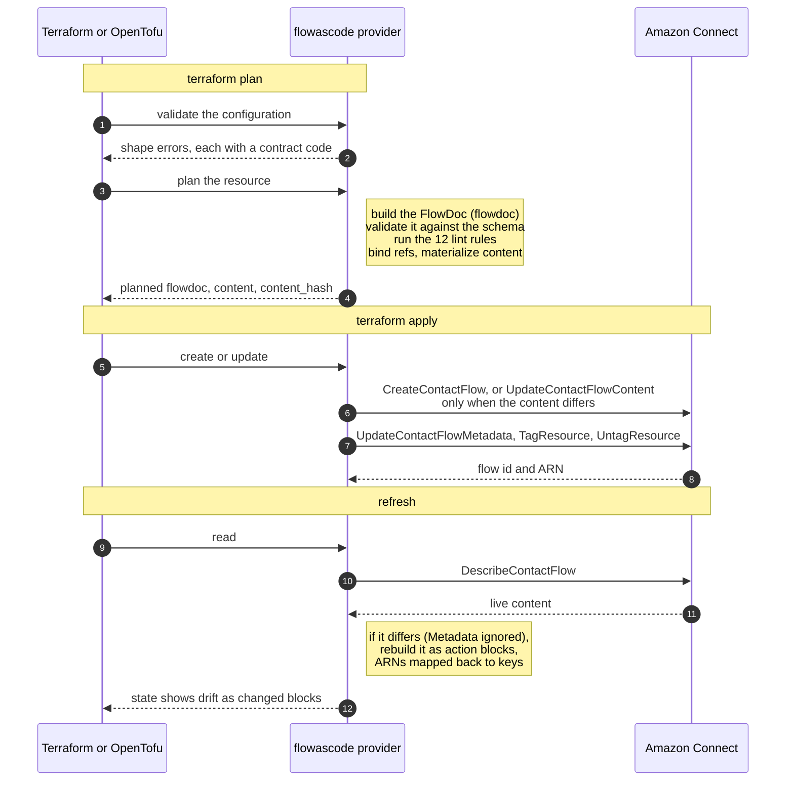
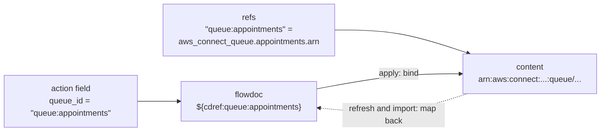
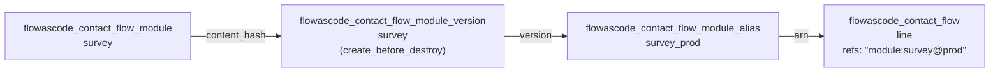
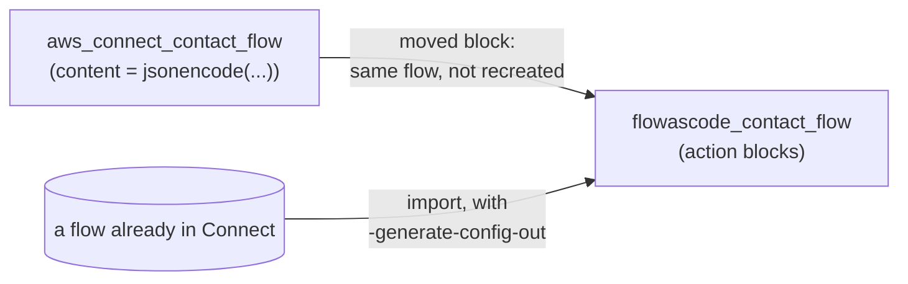

# terraform-provider-flowascode

The `flow-as-code/flowascode` provider for Terraform (1.8 and later) and
OpenTofu (1.10 and later): Amazon Connect contact flows authored natively in
HCL, one `action` block per action, created, updated and deleted through the
Amazon Connect API.

```hcl
resource "flowascode_contact_flow" "appointment_line" {
  instance_id = var.connect_instance_id
  name        = "appointment-line"
  type        = "CONTACT_FLOW"

  refs = {
    "queue:appointments" = aws_connect_queue.appointments.arn
  }

  action {
    id   = "welcome"
    next = "set-queue"
    message_participant {
      text = "Thanks for calling."
    }
    error {
      type = "NoMatchingError"
      next = "hang-up"
    }
  }

  action {
    id   = "set-queue"
    next = "hang-up"
    update_contact_target_queue {
      queue_id = "queue:appointments"
    }
    error {
      type = "NoMatchingError"
      next = "hang-up"
    }
  }

  action {
    id = "hang-up"
    disconnect_participant {}
  }
}
```

Releases are signed and published to the
[Terraform Registry](https://registry.terraform.io/providers/flow-as-code/flowascode)
and the [OpenTofu registry](https://search.opentofu.org/provider/flow-as-code/flowascode)
as `flow-as-code/flowascode`, from v0.1.0. [SECURITY.md](SECURITY.md) names the
signing key.

## One flow, three views

The provider is one of three ways to author the same document. The
[flow-as-code](https://github.com/flow-as-code/flow-as-code) project defines
FlowDoc, a JSON interchange format for a contact flow, and keeps a TypeScript
builder, a visual canvas and this HCL resource as equal views of it. The
studio opens a `.flow.tf` file, shows it as a canvas, and writes it back when
the canvas changes.



The shape of the HCL resource is a contract shared with the TypeScript
tooling: flow-as-code's `conformance/hcl/README.md` states every rule, and
this repository vendors that `conformance/` directory at a pinned commit
(`internal/conformance/COMMIT`) and passes the same fixtures. For every
conformance case, planning the case's HCL produces the case's FlowDoc byte
for byte in the computed `flowdoc` attribute. The provider never parses
`.tf` text itself; [decisions/0001](decisions/0001-no-hcl-parsing.md) says
why.

## What happens at plan, apply and refresh



Validation checks the shape: one typed sub-block per action, unique action
ids, and reference keys of the right type. The two hard lint rules, a
literal ARN and an unresolved reference token, fail the plan; every other
finding is a warning, and `lint { disable = [...] }` silences those.

The plan carries three computed attributes worth reading: `flowdoc` (the
canonical FlowDoc of the configuration, what the studio would show),
`content` (the Flow language JSON Connect will receive) and `content_hash`
(a hash of that content without its layout Metadata, so moving a block on
the canvas does not change it).

## References stay symbolic

An action never holds an ARN. A reference field holds a key, and the
resource's `refs` map binds each key to a Terraform expression, usually
another resource's `arn`. The FlowDoc keeps the key as a token; only the
content sent to Connect holds the ARN. Reading a flow back maps each ARN to
its key again through the same bindings, so drift and import come back as
keys, never as literal ARNs.



Reference types are `queue`, `hours`, `lambda`, `prompt`, `flow`, `module`
(with an optional `@alias`), `lex` and `view` (with an optional version). A
key with no binding fails the plan and names the `refs` entry to write; a
binding no action uses is a warning.

## Modules, versions and aliases

A flow module is a resource like a flow. A version snapshots its content and
is keyed to the module's `content_hash`, so changing the module creates a new
version; an alias points at a version, and a flow invokes the module through
the alias.



Connect will not delete a version an alias points at, so the version
resource needs `lifecycle { create_before_destroy = true }`: the new version
is created and the alias moved to it before the old version is destroyed.

## Coming from hashicorp/aws



A `moved` block takes over an `aws_connect_contact_flow` or
`aws_connect_contact_flow_module` in place. Import reads a live flow back as
action blocks and recovers each `refs` binding from the instance's queues,
hours of operation, prompts, Lambda functions, flows, modules, Lex bots and
views. The registry guide `migrate-from-aws-provider` has the steps.

## Requirements

| Requirement | Supported |
| --- | --- |
| Terraform | 1.8 and later |
| OpenTofu | 1.10 and later |
| FlowDoc | 0.2 (`flowdoc-0.2.schema.json`) |
| Credentials | hashicorp/aws's vocabulary: environment, shared config and profiles, `assume_role`, `endpoints { connect }` |

## Repository map

- `docs/`: the registry documentation, generated by tfplugindocs from the
  schema, `templates/` and `examples/` (`go generate ./...`; CI fails when it
  is stale). Every example is planned by the tests.
- `internal/`: the provider; [ARCHITECTURE.md](ARCHITECTURE.md) maps it.
- `decisions/`: design decisions made in this repository.
- `CHANGELOG.md`: each release names the vendored conformance commit and the
  FlowDoc version it reads.

License: Apache-2.0.
